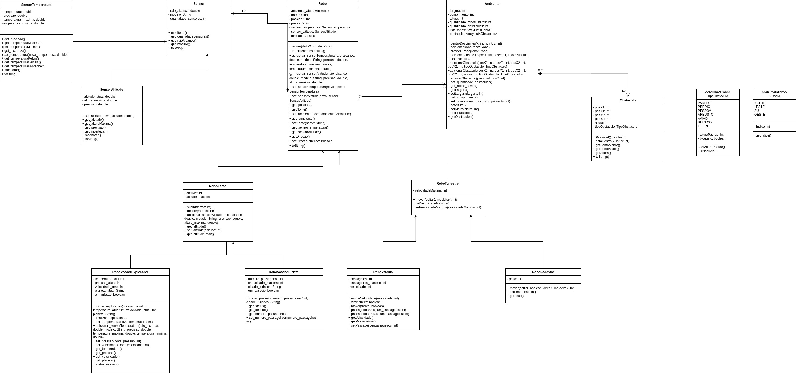

# Simulador de Robo
Repositorio utilizado para entrega de laboratórios da matéria MC322.

## Colaboradores
Felipe Pavanello Capovilla - 174411 <p>
Guilherme Henrique da Silva - 281217

## Execução
Comandos usados dentros de uma das pastas labXX.
```
javac -sourcepath src src/*.java -d bin
```
```
java -cp bin Main
```

## Diagrama UML
Diagrama de classes e relações do projeto.


