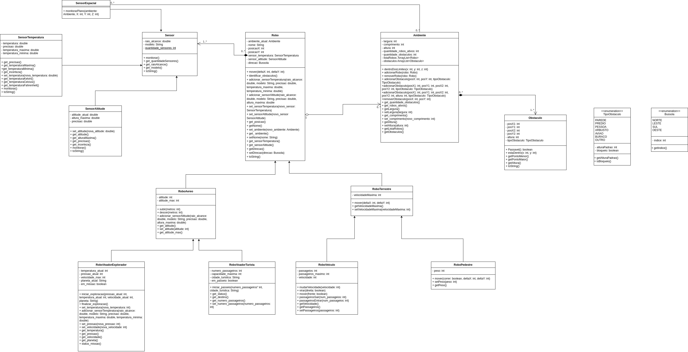

# Simulador de Robo
Repositorio utilizado para entrega de laboratórios da matéria MC322.

## Colaboradores
Felipe Pavanello Capovilla - 174411 <p>
Guilherme Henrique da Silva - 281217

# Manual
## Execução
Comandos usados dentros de uma das pastas labXX.
```
javac -sourcepath src src/*.java -d bin
```
```
java -cp bin Main
```

## Instruções
1. **MENU AMBIENTE** - ações relacionada ao ambiente
   - Impressão do mapa do ambiente na altura indicada, mostrando os robos e obstáculos
   - Informações do ambiente, como dimensões, robos ativos e obstáculos presentes
2. **MENU ROBO** - lista de robos ativos, escolher qual deseja controlar
   - RoboStandart
     - deslocamento no plano
     - imprimir o ambiente no raio de alcance do sensor
     - monitorar estado dos sensores
     - informações do robo
   - RoboAereoStandart
     - deslocamento no plano
     - deslocamento da altura (subir[+]/descer[-])
     - imprimir o ambiente no raio de alcance do sensor
     - monitorar estado dos sensores
     - informações do robo
   - RoboAereoExplorador
     - deslocamento no plano
     - deslocamento da altura (subir[+]/descer[-])
     - imprimir o ambiente no raio de alcance do sensor
     - Iniciar/Finalizar missão, indicando o planeta destino, velocidade, temperatura e pressão
     - monitorar estado dos sensores
     - informações do robo
   - RoboAereoTurista
     - deslocamento no plano
     - deslocamento da altura (subir[+]/descer[-])
     - imprimir o ambiente no raio de alcance do sensor
     - Iniciar/Finalizar passeio, indicando cidade turistica e número de passageiros
     - monitorar estado dos sensores
     - informações do robo
   - RoboTerrestreStandart
     - deslocamento no plano
     - imprimir o ambiente no raio de alcance do sensor
     - Definir a velocidade máxima de deslocamento do robo
     - monitorar estado dos sensores
     - informações do robo
   - RoboTerrestreVeiculo
     - deslocamento no plano, para frente ou para trás
     - mudar a velocidade de deslocamento
     - Virar a direção do robo
     - imprimir o ambiente no raio de alcance do sensor
     - Definir a velocidade máxima de deslocamento do robo
     - Mudar número de passageiros
     - monitorar estado dos sensores
     - informações do robo
   - RoboTerrestrePedestre
     - deslocamento no plano. Correndo( 1*velocidade máxima) ou Andando (0.6*velocidade máxima), deslocando-se menos quanto mais peso carrega 
     - imprimir o ambiente no raio de alcance do sensor
     - mudar peso do robo
     - Definir a velocidade máxima de deslocamento do robo
     - monitorar estado dos sensores
     - informações do robo

## Diagrama UML
Diagrama de classes e relações do projeto.



## Sobre
**IDE Utilizada:** Visual Studio Code <p>
**Versão do Java:** 11.0.26
