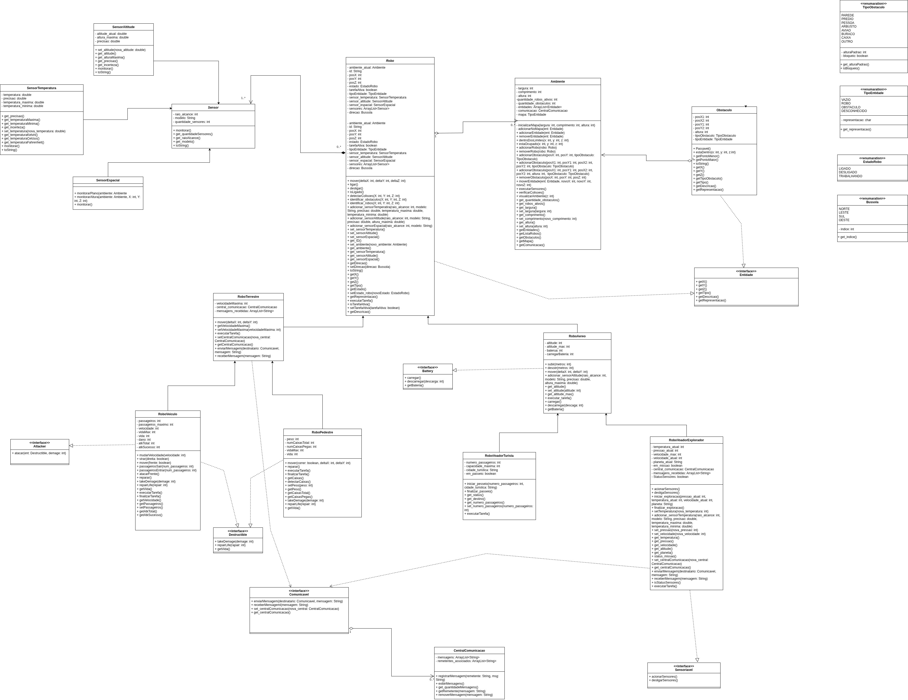

# Simulador de Robo
Repositorio utilizado para entrega de laboratórios da matéria MC322.

## Colaboradores
Felipe Pavanello Capovilla - 174411 <p>
Guilherme Henrique da Silva - 281217

# Adições
## LAB 4
- Implementação de interfaces
  - Entidade: Obstaculo e Robo
  - Comunicavel: RoboTerestre RoboVoadorExplorador
  - Sensoriavel: RoboVoadorExplorador
  - Battery: RoboAereo
  - Attacker: RoboVeiculo
  - Destructible: RoboVeiculo e RoboPedestre
- Criação de Exceptions personalizadas
  - ColisaoException: Ambiente, RoboAereo e Robo
  - ErroComunicacaoException: RoboVoadorExplorador, RoboTerrestre
  - LowBatteryException: RoboAereo
  - PointOutOfMapException: Ambiente, Robo, SensorEspacial
  - RoboDesligadoException: Robo, RoboPedestre, RoboVeiculo
  - SensorMissingException: RoboVoadorExplorador, RoboAereo
  - ValueOutOfBoundsException: RoboVoadorExplorador, RoboAereo, RoboVoadorTurista, RoboTerrestre, RoboVeiculo, SensorAltitude, SensorTemperatura
  - ZeroLifePointsException: RoboPedestre, RoboVeiculo
- Tornar o console modularizável
- Adição de Tarefas para: RoboVoadorExplorador, RoboVoadorTurista, RoboVeiculo e RoboPedestre

# Manual
## Execução
Comandos usados dentros de uma das pastas labXX.
```
javac -sourcepath src src/**/*.java -d bin
```
```
java -cp bin main/Main
```

## Instruções do MENU
1. **MENU AMBIENTE** - ações relacionada ao ambiente
   - Impressão do mapa do ambiente na altura indicada, mostrando os robos e obstáculos
   - Informações do ambiente, como dimensões, robos ativos e obstáculos presentes
2. **MENU ROBO** - lista de robos ativos, escolher qual deseja controlar
   - RoboAereoStandart
     - deslocamento no plano
     - deslocamento da altura (subir[+]/descer[-])
     - imprimir o ambiente no raio de alcance do sensor
     - monitorar estado dos sensores
     - carregar bateria
     - informações do robo
     - desligar robo
   - RoboAereoExplorador
     - deslocamento no plano
     - deslocamento da altura (subir[+]/descer[-])
     - imprimir o ambiente no raio de alcance do sensor
     - Iniciar/Finalizar missão, indicando o planeta destino, velocidade, temperatura e pressão
     - Iniciar Tarefa (realizar missão)
     - monitorar estado dos sensores
     - carregar robo
     - enviar mensagem
     - informações do robo
     - ligar/desligar sensores
     - desligar robo
   - RoboAereoTurista
     - deslocamento no plano
     - deslocamento da altura (subir[+]/descer[-])
     - imprimir o ambiente no raio de alcance do sensor
     - Iniciar/Finalizar passeio, indicando cidade turistica e número de passageiros
     - inicar tarefa (realizar passeio)
     - monitorar estado dos sensores
     - carregar robo
     - informações do robo
     - desligar robo
   - RoboTerrestreStandart
     - deslocamento no plano
     - imprimir o ambiente no raio de alcance do sensor
     - Definir a velocidade máxima de deslocamento do robo
     - monitorar estado dos sensores
     - enviar mensagem
     - informações do robo
     - desligar robo
   - RoboVeiculo
     - deslocamento no plano, para frente ou para trás
     - mudar a velocidade de deslocamento
     - Virar a direção do robo
     - imprimir o ambiente no raio de alcance do sensor
     - Definir a velocidade máxima de deslocamento do robo
     - Mudar número de passageiros
     - iniciar tarefa (realizar 1-5 ataque bem-sucedidos)
     - atacar na frente
     - reparar robo
     - monitorar estado dos sensores
     - enviar mensagem
     - informações do robo
     - desligar robo
   - RoboPedestre
     - deslocamento no plano. Correndo(100% velocidade máxima) ou Andando (60% velocidade máxima), deslocando-se menos quanto mais peso carrega 
     - imprimir o ambiente no raio de alcance do sensor
     - Definir a velocidade máxima de deslocamento do robo
     - reparar robo
     - monitorar estado dos sensores
     - iniciar tarefa (coletar 1-8 caixas no mapa)
     - enviar mensagem
     - informações do robo
     - desligar robo

## Diagrama UML
Diagrama de classes e relações do projeto.



## Arquivos
#### Main
- **Main.java** - arquivo principal que instancia os principais objetos e forma as relações entre eles;
#### Ambiente
- **Ambiente.java** - simulador do ambiente virtual no qual estão estabelecidos os objetos `Robo` e `Obstaculo`;
- **Obstaculo.java** - objeto imovel do ambiente que pode bloquear a passagem de `Robo`;
#### Console
- **Console.java** - interface com usuário através do terminal;
- **MenuItem.java** - modelo para guardar as informações de uma opção do menu;
#### Robo
- **Robo.java** - classe mais geral do `Robo` que possui os métodos mais amplos;
  - **RoboAereo.java** - classe geral de `Robo` voador, implementando o movimento vertical;
    - **RoboVoadorExplorador.java** - classe especialista de `RoboAereo`que inclui missões para planetas;
    - **RoboVoadorTurista.java** - classe especialista de `RoboAereo`que inclui passeios turisticos para cidades;
  - **RoboTerrestre.java** - classe geral de `Robo` voador, implementando o velocidade máxima;
    - **RoboVeiculo.java** - classe especialista de `RoboTerretre`que inclui movimento apenas no sentido da direção do robo;
    - **RoboPedestre.java** - classe especialista de `RoboTerretre`que inclui movimento de andar e correr, com modificações com o peso;
#### Sensor
- **Sensor.java** - classe de sensor padrão sem utilidade especifica incluido nos objetos `Robo`;
  - **SensorAltitude.java** - sensor especializado em detectar a altura do `Robo`;
  - **SensorEspacial.java** - sensor que monitora o espaço em volta do `Robo` num quadrado de lado 2 x raio;
  - **SensorTemperatura.java** - sensor que mede a temperatura do `Robo`;
#### Central Comunicação
- **CentralComunicacao.java** - objeto intermediário das comunicações entre classes que implementam `Comunicavel` 
#### Interfaces
- **Entidade.java** - interface para objetos entidade;
- **Attacker.java** - interface para `Entidade` atacar `Destructible`;
- **Destructible.java** - interface para `Entidade` que pode ser destruído;
- **Battery.java** - interface para `Entidade` que possui bateria;
- **Comunicavel.java** - interface para `Entidade` que pode se comunicar com outros `Comunicavel`;
- **Sensoriavel.java** - interface para `Entidade` que podem ligar e desligar sensores;
#### Constantes
- **Bussola.java** - enum das quatro direções da bússola;
- **TipoObstaculo.jaava** - enum de tipos de `Obstaculo` padrão, determinando se não atravessáveis.
- **EstadoRobo.java** - enum do estado do `Robo`: LIGADO ou DESLIGADO;
- **TipoEntidade.java** - enum dos tipos de `Entidade` que existem;
#### Exceptions
- **ColisaoException.java** - excessão ocorre quando duas `Entidade`s no mesmo local do ambiente;
- **ErroComunicacaoException.java** - excessão ocorre quando há um erro durante a comunicação;
- **LowBatteryException.java** - excessão ocorre quando uma `Entidade` que implementa `Battery` tenta realizar uma ação que gasta mais energia do que possui;
- **PointOutOfMapException.java** - excessão ocorre quando tenta acessar um ponto fora do ambiente;
- **RoboDesligadoException.java** - excessão ocorre quando tenta realizar uma ação com `Robo` enquanto está DESLIGADO;
- **SensorMissingException.java** - excessão ocorre quando tenta acessar um sensor que não está instalado;
- **ValueOutOfBoundsException.java** - excessão ocorre quando uma variável recebe um valor fora de um intervalo determinado pelo código;
- **ZeroLifePointsException.java** - excessão ocorre quando uma `Entidade` que implementa `Destructible` tenta realizar uma ação enquanto não possui vida;

## Sobre
**IDE Utilizada:** Visual Studio Code <p>
**Versão do Java:** 11.0.26
